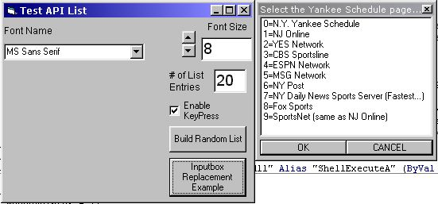



## API Listbox as Inputbox Replacement

### Description

This Code was written by Dave Andrews

and modified by Tom Pydeski

It is an api form with a listbox which can be used as an inputbox replacement where the user is presented with a list of choices in a listbox form instead of the standard inputbox.

modifications include:

made list 3d

automatically size list based on the number

of entries and the width of the longest entry

added the keystroke capability

added the option of changing the font to that of the calling form

or any of its container controls that support .textheight.

added double click capability to the list
 
### More Info
 
A list in an array

A list of selected items (if in multiselect mode) or a number representing the selected index

none (hopefully...:-)

             |
---                |---
**Submitted On**   |2002-05-27 21:09:00
**By**             |[Tom Pydeski](https://github.com/Planet-Source-Code/PSCIndex/blob/master/ByAuthor/tom-pydeski.md)
**Level**          |Intermediate
**User Rating**    |4.8 (29 globes from 6 users)
**Compatibility**  |VB 6\.0
**Category**       |[Windows API Call/ Explanation](https://github.com/Planet-Source-Code/PSCIndex/blob/master/ByCategory/windows-api-call-explanation__1-39.md)
**World**          |[Visual Basic](https://github.com/Planet-Source-Code/PSCIndex/blob/master/ByWorld/visual-basic.md)
**Archive File**   |[API\_Listbo874815272002\.zip](https://github.com/Planet-Source-Code/tom-pydeski-api-listbox-as-inputbox-replacement__1-35173/archive/master.zip)

### API Declarations

quite a few...

